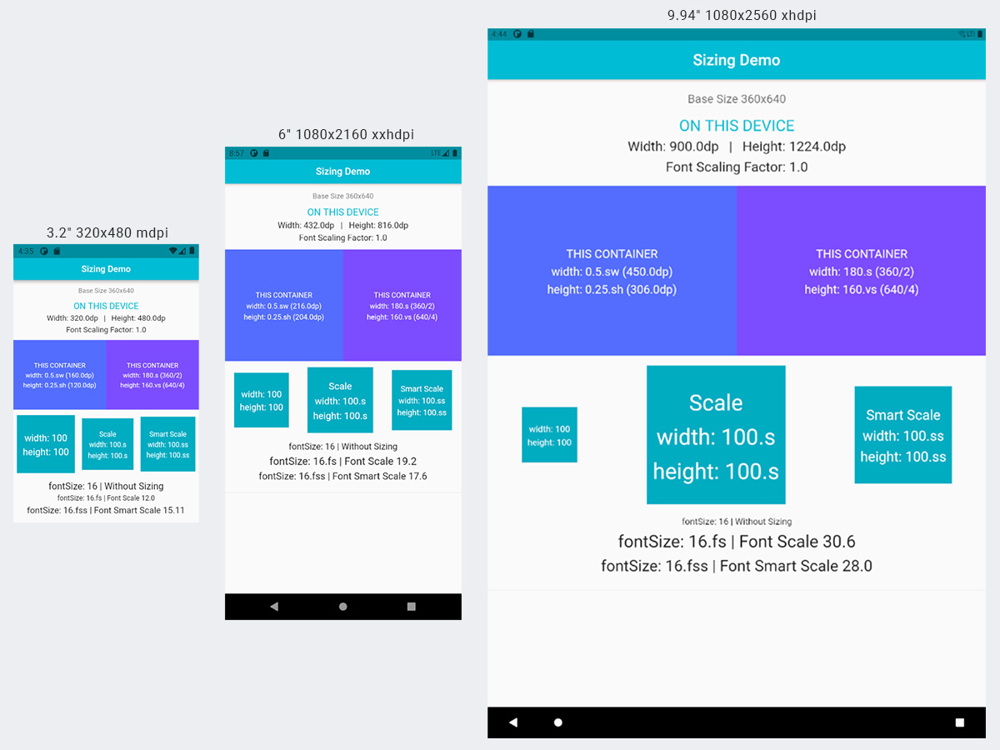

# Sizing

**Simple flutter package to handle scaling / responsive user interfaces (UI) on different screen
sizes. Part of the idea is taken from the component for RN Size Matters, flutter_screenutil,
and others.**

## Getting Started

### Adding package

```yaml
sizing: ^1.1.1
```

### Importing package

```yaml
import 'package:sizing/sizing.dart';
```

## Wrap your main builder with SizingBuilder and you're ready to go

```dart
void main() => runApp(MyApp());

class MyApp extends StatelessWidget {
    @override
    Widget build(BuildContext context) {
        return SizingBuilder(
        builder: () => MaterialApp(
                ...
            ),
        );
    }
}
```

## Passing values

```dart
  //In Sizing, as in many of the packages that exist for handling interface scaling (responsive),
  //a base width and height are set as the starting point for scaling. In Sizing these base values
  //are width: 360 and height: 640.
  baseSize: Size(360, 640), //Not required. Change these values through SizingBuilder

  // Screen Width and Screen Height
  width: 1.sw, //100% width
  height: 0.5.sh, //50% height

  //Scale
  width: 360.s, //100% of the base width, the value will scale from this point.

  //Vertical scale
  height: 320.vs, //50% of the base height, the value will scale from this point.

  //Smart scale
  width: 100.ss,

  //Font scale.
  fontSize: 16.fs

  //Font Smart Scale.
  fontSize: 16.fss,

  //if you want the fonts to scale with the system accessibility option (Android / IOs) define
  //on SizingBuilder systemFontScale with true (by default false).
  systemFontScale: true, //not required

  //if you want a particular text to scale with the system accessibility option regardless
  //of the global setting (systemFontScale). *Apply only to fontSize to avoid unwanted behaviors.
  fontSize: 16.fs.self(true), //self(false)

  //On Smart Scale (ss) and Font Smart Scale (fss) a scale factor comes into play, this factor
  //by default is 0.5; Use this to manipulate this value. *We recommend only applying to .ss
  //and .fss to avoid unwanted behavior.
  height: 100.ss.f(0.8),
  fontSize: 16.fss.f(0.1),
```

## Demo


